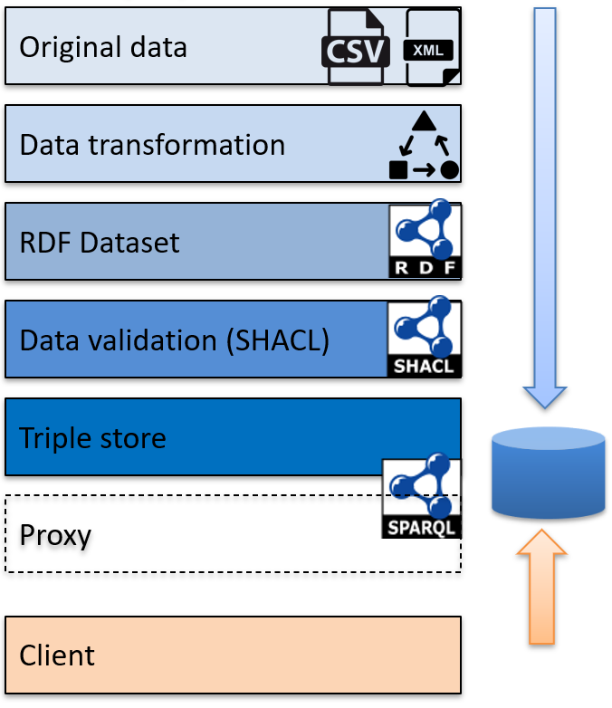

# Linked Data Prototype - Data
The following full-stack has been implemented and is available in this repository:  


Find here under explanations about:
- [Original data and data transformation](#data-transformation)
- [Data validation](#data-validation-with-shacl)
- [Data stored in two triple stores and client interrogation on the SPARQL endpoints](#data-stored-in-two-triple-stores-and-client-interrogation-on-the-sparql-endpoints)

The proxy to secure the data access is described and available in [this repository](https://github.com/swiss/ld-prototype-proxy)

## Data transformation 
Fictive datasets were created to simulate UPI and EWR informations.

The choosen data model are the SEMIC core vocabularies:
- [Core Person Vocabulary](https://semiceu.github.io/Core-Person-Vocabulary/releases/2.1.0/) for the UPI dataset of people's basic informations  
- [Core Criterion and Core Evidence Vocabulary](https://semiceu.github.io/CCCEV/releases/2.1.0/) for the EWR dataset of people's principal residences  

### UPI and EWR data - CSV to RDF transformation 

- The [UPI dataset creation](UC-Serafe/UPI-Dataset-fiction) based on the [tarql](https://tarql.github.io/) tool  
    Tarql can be run on Windows or Linux with `run.bat` and `run.sh` respectively (found [here](UC-Serafe/UPI-Dataset-fiction/tarql-1.2/bin))  
- The [EWR dataset creation](UC-Serafe/EWR-Dataset-fiction) based on [tarql](https://tarql.github.io/)   
    Tarql can be run on Windows or Linux with `run.bat` and `run.sh` respectively (found [here](UC-Serafe/EWR-Dataset-fiction/tarql-1.2/bin))


### UPI data - XML to RDF transformation
The [XML2RDF](XML2RDF) folder contains example of tools to demonstrate how XML can be transformed to RDF:
- The [first example](XML2RDF/sparql-generate) is based on [sparql-generate](https://github.com/sparql-generate/sparql-generate)   
- The [second example](XML2RDF/rocketRML) is based on [rocketRML](https://github.com/semantifyit/RocketRML)  
See the documentation of the tool about its installation that might require [node.js and npm](https://docs.npmjs.com/downloading-and-installing-node-js-and-npm).

Both examples contain a `run.sh` to transform the file persons-eCH0044.xml. It is the same XML file in both examples, that contains 5 fictional caracters as a complement to the UPI dataset generated here above.  
More information will be given about those tools soon.


## Data validation with SHACL
RDF data can be validated with the W3C standard [Shapes Constraint Language (SHACL)](https://www.w3.org/TR/shacl/).  
  
The generated UPI and EWR datasets, presented here above, are based and the SEMIC ontologies and can be validated with their provided SHACL files:  
- UPI dataset based on the [Core Person Vocabulary](https://semiceu.github.io/Core-Person-Vocabulary/releases/2.1.0/), find the SHACL file [here](https://semiceu.github.io/Core-Person-Vocabulary/releases/2.1.0/#shacl).  
- EWR dataset based on the [Core Criterion and Core Evidence Vocabulary](https://semiceu.github.io/CCCEV/releases/2.1.0/), find the SHACL file [here](https://semiceu.github.io/CCCEV/releases/2.1.0/#validation).  

To run the SHACL validation we use the [Apache Jena implementation](https://jena.apache.org/download/index.cgi) (Apache Jena Commands, version 5.1.0).  
  
The [shacl](shacl) folder contains the necessary tools and files to perform the SHACL validation:  
- The Jena tool unzipped in the `apache-jena-5.1.0` sub-folder   
- The two generated datasets  `UPI_Personnes_fiction.ttl` and `EWR_ResidencesPrincipales.ttl`  
- The SHACL files `core-person-ap-SHACL.ttl` and `cccev-ap-SHACL.ttl`  
Note: the `cccev-ap-SHACL.ttl` was adapted to `cccev-ap-SHACL_corrected.ttl` to avoid mixing http and https URLs for the time ontology
- `runUPI.sh` and `runEWR.sh` to execute the SHACL validation  

## Data stored in two triple stores and client interrogation on the SPARQL endpoints
The [Python POC](UC-Serafe/client-POC) with SPARQL queries to two local SPARQL endpoints (EWR and UPI) that can be easily launched locally  
The Python code relies on rdflib ([Code](https://github.com/RDFLib/rdflib) and [Documentation](https://rdflib.readthedocs.io/en/stable/))

The POC was run on Ubuntu:
- Launch the EWR SPARQL endpoint with startEWR.sh  
The endpoint is published on `http://localhost:8000/`
- Launch the UPI SPARQL endpoint with startUPI.sh  
The endpoint is published on `http://localhost:8001/`
- Run the client code with 3 parameters
    ```
    python3 serafe_sparql_query.py --queryNumber 5 --ewr_endpoint http://localhost:8000/ --upi_endpoint=http://localhost:8001/
    ```
    Use the parameter queryNumber to choose which query to run:  
    1 Federated SPARQL  
    2 Two queries  
    3 Multiple queries  
    4 Wikidata dereferencing  
    5 All

    To display the information about the expected parameters:
    ```
    python3 serafe_sparql_query.py
    ```

**Remark**: The client code is sending SPARQL queries to the SPARQL end-points passed in parameters, this POC would thus work with any SPARQL end-point (and any triple store) that host the data